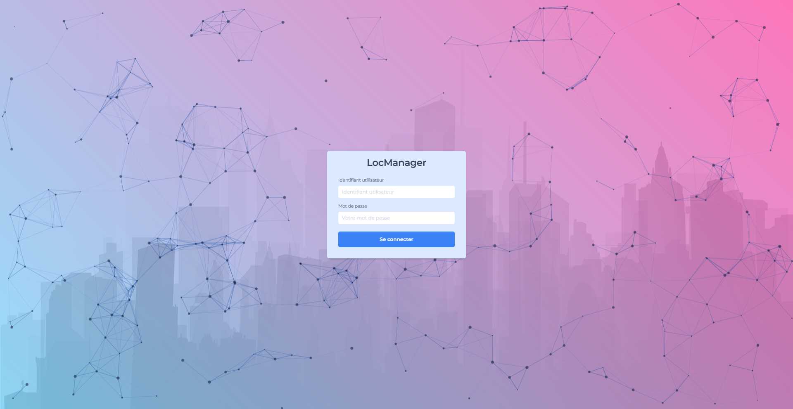
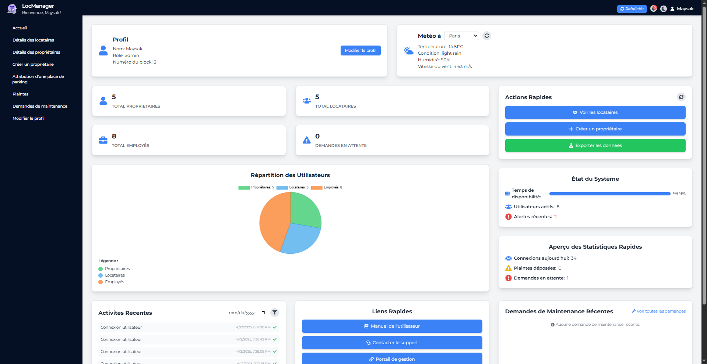
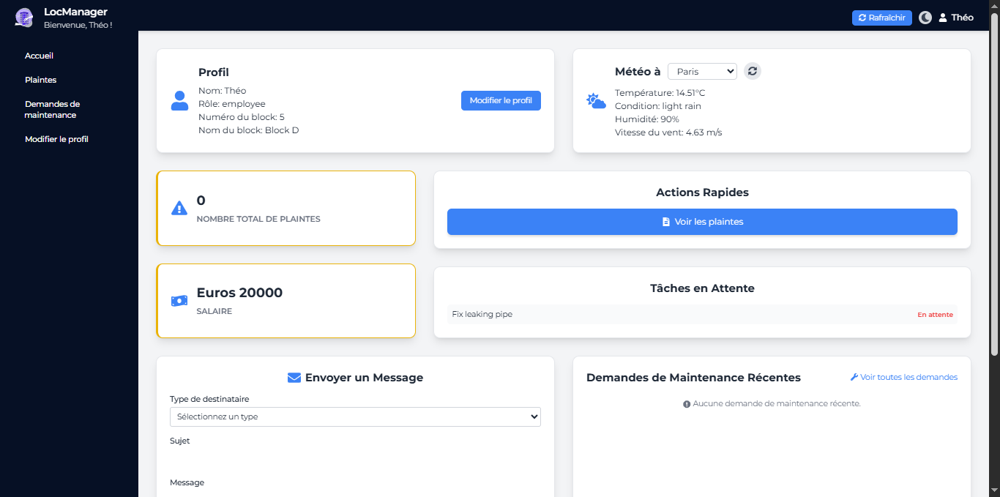
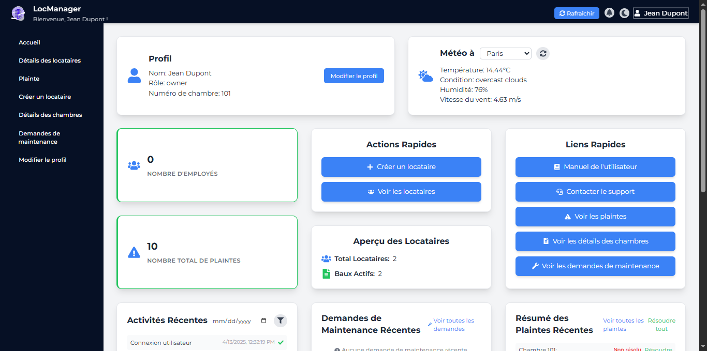
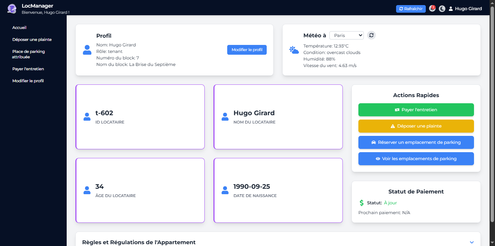
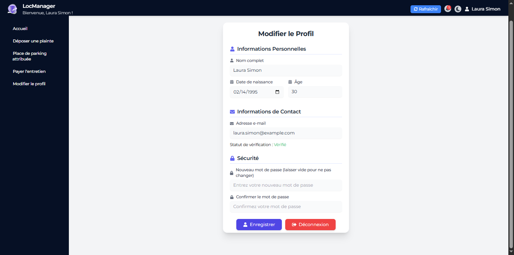

# LocManager - Gestion Immobilière Simplifiée


**LocManager** est une application web conçue pour simplifier la gestion immobilière pour les administrateurs, employés, propriétaires et locataires. Elle permet de gérer les profils des utilisateurs, les plaintes, les demandes de maintenance, les paiements d'entretien, et bien plus encore, tout en offrant une interface utilisateur intuitive et moderne.

---

## Table des Matières

- [Aperçu](#aperçu)
- [Fonctionnalités](#fonctionnalités)
- [Captures d'Écran](#captures-décran)
- [Technologies Utilisées](#technologies-utilisées)
- [Installation](#installation)
- [Utilisation](#utilisation)
- [Structure de la Base de Données](#structure-de-la-base-de-données)
- [Données Fictives pour Tests](#données-fictives-pour-tests)
- [Identifiants de Test](#identifiants-de-test)
- [Contribuer](#contribuer)
- [Licence](#licence)

---

## Aperçu

LocManager est une plateforme de gestion immobilière qui répond aux besoins de différents types d'utilisateurs dans un complexe résidentiel :

- **Administrateurs** : Gèrent les locataires, propriétaires, employés, plaintes, et demandes de maintenance.
- **Employés** : Accèdent aux plaintes et demandes de maintenance dans leur bloc assigné.
- **Propriétaires** : Gèrent leurs locataires, plaintes, et demandes de maintenance.
- **Locataires** : Déposent des plaintes, demandent des réparations, et paient l'entretien.

L'application est construite avec une architecture client-serveur, utilisant **React** pour le frontend et **Node.js** avec **Express** pour le backend, connecté à une base de données **MySQL**.

---

## Fonctionnalités

### Pour les Administrateurs
- Gestion des profils des locataires, propriétaires, et employés.
- Création de nouveaux propriétaires.
- Attribution de places de parking.
- Visualisation et résolution des plaintes.
- Gestion des demandes de maintenance.
- Modification du profil personnel.
- Portail de gestion pour des analyses globales.

### Pour les Employés
- Visualisation des plaintes dans leur bloc.
- Gestion des demandes de maintenance assignées.
- Modification du profil personnel.

### Pour les Propriétaires
- Gestion des locataires dans leurs chambres.
- Visualisation des plaintes déposées par leurs locataires.
- Création de nouveaux locataires.
- Gestion des demandes de maintenance.
- Modification du profil personnel.

### Pour les Locataires
- Dépôt de plaintes.
- Demande de réparations (maintenance).
- Visualisation de la place de parking attribuée.
- Paiement de l'entretien.
- Modification du profil personnel.

### Fonctionnalités Générales
- Authentification sécurisée avec vérification par email.
- Notifications en temps réel.
- Messagerie entre utilisateurs (par exemple, employé vers admin).
- Tableau de bord avec statistiques (connexions, plaintes, demandes en attente).
- Mode sombre pour une meilleure expérience utilisateur.

---

## Captures d'Écran

### Page de Connexion


### Tableau de Bord Administrateur


### Tableau de Bord Employé


### Tableau de Bord Propriétaire


### Tableau de Bord Locataire


### Page de Modification de Profil


### Page de Dépôt de Plainte (Locataire)


### Page de Gestion des Demandes de Maintenance


---

## Technologies Utilisées

### Frontend
- **React**
- **React Router**
- **Axios**
- **React Toastify**
- **Framer Motion**
- **React Icons**
- **Tailwind CSS**

### Backend
- **Node.js**
- **Express**
- **MySQL2**
- **Nodemailer**
- **UUID**
- **Express Validator**

### Base de Données
- **MySQL**

---

## Installation

### Prérequis

- **Node.js** (version 16 ou supérieure)
- **MySQL** (version 8 ou supérieure)
- **Git** (pour cloner le dépôt)

---

### Étapes d'Installation

#### 1. Cloner le Dépôt

```bash
git clone https://github.com/votre-utilisateur/locmanager.git
cd locmanager
```

---

## 🛠️ Installer les Dépendances du Backend

```bash
cd backend
npm install
```

---

## ⚙️ Configurer les Variables d'Environnement (Backend)

Créez un fichier `.env` dans le dossier `backend` avec les variables suivantes :

```env
DB_HOST=localhost
DB_USER=root
DB_PASSWORD=votre-mot-de-passe
DB_DATABASE=app
REACT_APP_SERVER=http://localhost:5000
WEATHER_API_KEY=votre-clé-openweathermap
FRONTEND_URL=http://localhost:3000
```

---

## 🗄️ Configurer la Base de Données

```bash
mysql -u root -p app < app.sql
```

Ajoutez ensuite les données de test en exécutant les requêtes SQL fournies dans le projet.

---

## 🌐 Installer les Dépendances du Frontend

```bash
cd ../frontend
npm install
```

---

## ⚙️ Configurer les Variables d'Environnement (Frontend)

Créez un fichier `.env` dans le dossier `frontend` avec :

```env
REACT_APP_SERVER=http://localhost:5000
```

---

## 🚀 Démarrer les Applications

### 🔙 Démarrer le Backend

```bash
cd ../backend
npm start
```

Le serveur sera disponible à l'adresse : [http://localhost:5000](http://localhost:5000)

### 🔜 Démarrer le Frontend

```bash
cd ../frontend
npm start
```

L'application sera disponible à l'adresse : [http://localhost:3000](http://localhost:3000)

---

## Utilisation

### 🔐 Connexion

Accédez à [http://localhost:3000](http://localhost:3000).  
Utilisez les identifiants de test pour vous connecter selon votre rôle : administrateur, employé, propriétaire ou locataire.

### 📊 Navigation

Une fois connecté, vous verrez le tableau de bord adapté à votre type d’utilisateur.  
Utilisez la barre latérale pour accéder aux fonctionnalités disponibles.

### ✏️ Modification de Profil

Dans l'onglet "Modifier le profil", vous pouvez :

- Mettre à jour votre nom, email et mot de passe.
- Recevoir un email de vérification si l'adresse est modifiée.

### 📢 Dépôt de Plaintes (Locataires)

Les locataires peuvent déposer une plainte via la page dédiée.

### 🔧 Gestion des Demandes de Maintenance

- **Locataires** : soumettent des demandes.
- **Admins / Employés** : consultent et gèrent les demandes.

---

## Structure de la Base de Données

La base de données `app` contient les tables suivantes :

| Table | Description |
|-------|-------------|
| `block_admin` | Infos des administrateurs |
| `employee` | Infos des employés |
| `owner` | Infos des propriétaires |
| `tenant` | Infos des locataires |
| `block` | Blocs du complexe |
| `room` | Chambres |
| `rental` | Contrats de location |
| `parking_slots` | Places de parking disponibles |
| `maintenance_requests` | Demandes de maintenance |
| `activities` | Activités utilisateurs |
| `notifications` | Notifications utilisateurs |
| `messages` | Messages internes |
| `system_alerts` | Alertes système |
| `stats_history` | Statistiques historiques |

---

## Données Fictives pour Tests

Vous pouvez utiliser les requêtes dans `sample_data.sql` (ou équivalent) pour insérer des données fictives.

---

## Identifiants de Test

| Rôle          | Email                      | Mot de passe        |
|---------------|----------------------------|--------------       |
| Admin         | admin@locmanager.com       | LocManager2024@     |
| Employé       | employe@locmanager.com     | LocManager2024@     |
| Propriétaire  | proprio@locmanager.com     | LocManager2024@     |
| Locataire     | locataire@locmanager.com   | LocManager2024@     |

---

## Contribuer

Les contributions sont les bienvenues !  
Merci de suivre les étapes suivantes :

1. Fork le projet
2. Créez une branche : `git checkout -b feature/ma-fonctionnalite`
3. Commitez vos modifications : `git commit -m 'Ajout d'une fonctionnalité'`
4. Poussez vers la branche : `git push origin feature/ma-fonctionnalite`
5. Ouvrez une **Pull Request**

---

